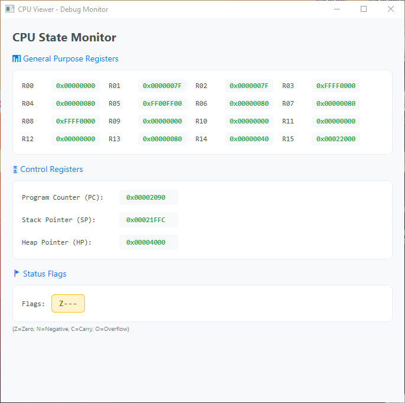
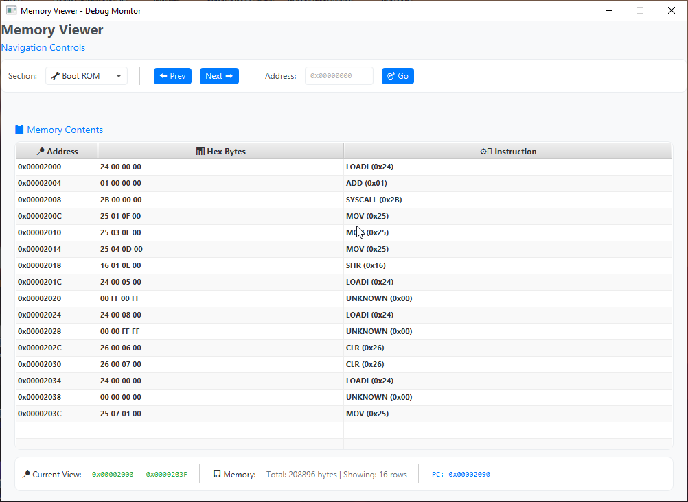

# Neptune Assembly Project




## Project Overview
The Neptune Assembly Project is a comprehensive assembly language environment featuring a custom CPU architecture with a complete instruction set, memory management system, and debugging tools. The project includes a Neptune CPU emulator with visualization capabilities and VRAM support for graphics operations.

## Instruction Set Reference

### Arithmetic Instructions
| Instruction | Format            | Description                                      |
|-------------|-------------------|--------------------------------------------------|
| ADD         | `rDest, rSrc`    | Add rSrc to rDest                                |
| ADDI        | `rDest, imm`     | Add immediate to rDest                           |
| SUB         | `rDest, rSrc`    | Subtract rSrc from rDest                         |
| SUBI        | `rDest, imm`     | Subtract immediate from rDest                    |
| MUL         | `rDest, rSrc`    | Multiply rDest by rSrc                           |
| MULI        | `rDest, imm`     | Multiply rDest by immediate                      |
| DIV         | `rDest, rSrc`    | Divide rDest by rSrc                             |
| DIVI        | `rDest, imm`     | Divide rDest by immediate                        |
| MOD         | `rDest, rSrc`    | Modulo rDest by rSrc                             |
| MODI        | `rDest, imm`     | Modulo rDest by immediate                        |
| INC         | `rDest`          | Increment rDest by 1                             |
| DEC         | `rDest`          | Decrement rDest by 1                             |
| NEG         | `rDest`          | Negate rDest                                     |

### Logical Instructions
| Instruction | Format            | Description                                      |
|-------------|-------------------|--------------------------------------------------|
| AND         | `rDest, rSrc`    | Bitwise AND rDest with rSrc                      |
| ANDI        | `rDest, imm`     | Bitwise AND rDest with immediate                 |
| OR          | `rDest, rSrc`    | Bitwise OR rDest with rSrc                       |
| ORI         | `rDest, imm`     | Bitwise OR rDest with immediate                  |
| XOR         | `rDest, rSrc`    | Bitwise XOR rDest with rSrc                      |
| XORI        | `rDest, imm`     | Bitwise XOR rDest with immediate                 |
| NOT         | `rDest`          | Bitwise NOT of rDest                             |

### Memory Instructions
| Instruction | Format            | Description                                      |
|-------------|-------------------|--------------------------------------------------|
| LOAD        | `rDest, rAddr`   | Load word from memory at rAddr into rDest        |
| STORE       | `rSrc, rAddr`    | Store word from rSrc into memory at rAddr        |

### Control Flow Instructions
| Instruction | Format            | Description                                      |
|-------------|-------------------|--------------------------------------------------|
| JMP         | `address`         | Unconditional jump                               |
| JZ          | `address`         | Jump if zero flag set                            |
| JNZ         | `address`         | Jump if zero flag not set                        |
| JL          | `address`         | Jump if negative flag set                        |
| JG          | `address`         | Jump if not zero and not negative                |
| CALL        | `address`         | Push PC and jump to address                      |
| RET         |                   | Pop PC from stack and jump                       |

## System Calls

### `set_pixel_RGBA32` (Syscall 0)
Sets a pixel in VRAM at specified coordinates.

**Parameters:**
- `r1`: X coordinate (0 to width-1)
- `r2`: Y coordinate (0 to height-1)
- `r3`: RGBA32 color value (0xAARRGGBB)
- `r4`: Screen width in pixels

### `get_neptune_vram_info` (Syscall 1)
Returns Neptune VRAM configuration information.

**Output:**
- `r1`: VRAM base address (0x0000A000)
- `r2`: VRAM total size (65,536 bytes)
- `r3`: Screen width (128 pixels)
- `r4`: Screen height (128 pixels)

## Example Program

```assembly
; Neptune Assembly Program - Half Green, Half Blue Screen Fill

START:
    ; Get VRAM information
    LOADI r0, 1          ; System call 1: Get VRAM info
    SYSCALL              ; r1=start, r2=size, r3=width, r4=height

    ; Store VRAM info for later use
    MOV r15, r1          ; r15 = VRAM start address
    MOV r14, r3          ; r14 = width (save for syscall parameter)
    MOV r13, r4          ; r13 = height (save for loop comparison)

    ; Calculate half width
    SHR r14, 1           ; r14 = width/2 (halfway point)

    ; Set up colors
    LOADI r5, 0xFF00FF00 ; Green color (ARGB: Alpha=FF, Red=00, Green=FF, Blue=00)
    LOADI r8, 0xFFFF0000 ; Blue color (ARGB: Alpha=FF, Red=00, Green=00, Blue=FF)

    ; Fill screen using pixel syscall
    CLR r6               ; r6 = y coordinate (row)
outer_loop:
    CLR r7               ; r7 = x coordinate (column)
    inner_loop:
        ; Set parameters for set_pixel_RGBA32 syscall
        LOADI r0, 0      ; r0 = syscall number (set_pixel_RGBA32)
        MOV r1, r7       ; r1 = x coordinate
        MOV r2, r6       ; r2 = y coordinate

        ; Choose color based on x position
        CMP r7, r14      ; Compare x with width/2
        JL green_half     ; If x < width/2, use green
        MOV r3, r8       ; Else use blue
        JMP set_pixel
    green_half:
        MOV r3, r5       ; Use green color

    set_pixel:
        MOV r4, r14      ; r4 = original width (restore it)
        SHL r4, 1        ; Multiply by 2 since we divided by 2 earlier

        ; Call set_pixel syscall
        SYSCALL

        ; Move to next column
        INC r7
        CMP r7, r4       ; Compare x with full width
        JL inner_loop

    ; Move to next row
    INC r6
    CMP r6, r13          ; Compare y with height
    JL outer_loop

    ; Halt the program
    HLT
```

## Debugging Tools
Use the included debugging tools to inspect program execution:
- `CpuViewer`: Monitor register values and CPU state
- `MemoryViewer`: Examine memory contents
- `VramViewer`: Visualize VRAM content in RGBA32 format

## Register Convention
- `r0-r15`: General purpose registers
- Flags: Zero (Z), Negative (N), Overflow (V), Carry (C)

## License
This project is licensed under the MIT License. See the LICENSE file for details.